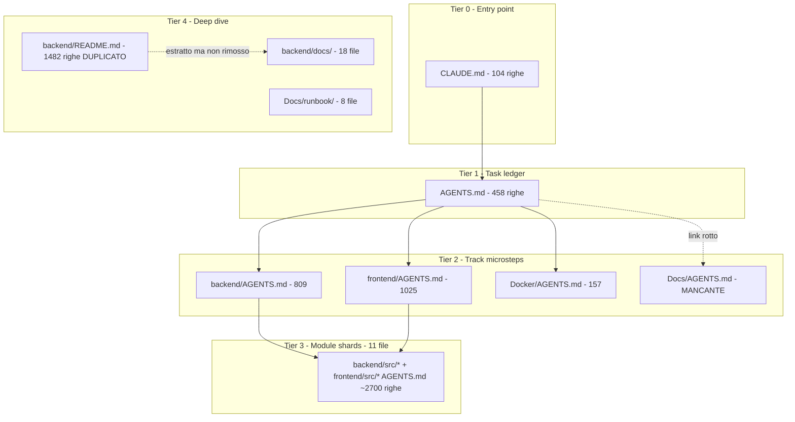
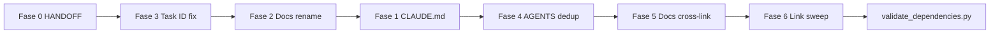

# Piano armonizzazione documentazione TickerTracker v3.0

## Stato attuale (diagnosi)

Il repo contiene **75 file `.md`** (69 sotto `Standalone-app-v1/`). La documentazione è frammentata in 4 silos che si sovrappongono:



**Problemi critici identificati:**
- ~**5.700 righe** di `AGENTS.md` con **40–60% contenuto duplicato**
- **Progress Tracker** in root [`AGENTS.md`](Standalone-app-v1/AGENTS.md) **non allineato** al codice (es. TASK 2.26 Outbox ⬜ vs implementato come TASK 2.25 in backend)
- **Conflitti task ID** (bloccanti per agenti LLM): TASK 3.10, 4.11/4.12, 2.25/2.26
- Refactor giugno 2026 ([`HANDOFF.md`](Standalone-app-v1/Docs/HANDOFF.md)) **~60% completato**: 12 deep-dive creati, ma README non slimato e 5 log TASK non archiviati
- Casing inconsistente: cartella `Docs/` vs link `docs/`; `Docker/` vs `docker/`
- [`CLAUDE.md`](Standalone-app-v1/CLAUDE.md) punta ancora a `PROJECT_ANALYSIS.md` (eliminato) invece di [`Docs/PROJECT-STATUS.md`](Standalone-app-v1/Docs/PROJECT-STATUS.md)

---

## Architettura target: gerarchia a 4 livelli

| Livello | File | Contenuto ammesso | Contenuto vietato |
|---------|------|-------------------|-------------------|
| **0** | [`CLAUDE.md`](Standalone-app-v1/CLAUDE.md) | Invarianti architetturali, roster sub-agent, workflow, quirks, **Doc Map** con link | Task microstep, progress tracker, deep-dive tecnici |
| **1** | [`AGENTS.md`](Standalone-app-v1/AGENTS.md) (root) | Progress Tracker, grafo dipendenze, statistiche, link ai track | Regole globali (→ CLAUDE), microstep dettagliati |
| **2** | Track `AGENTS.md` | Microstep completi per track (backend/frontend/Docker/Docs) | Duplicare invarianti CLAUDE; copiare intero catalogo nei nested |
| **3** | Module `AGENTS.md` | Scope locale, file toccati, note implementative, link al parent | Full task spec copiata dal parent |
| **4** | README + `backend/docs/` + `Docs/` | Quick start, runbook, reference tecnica | Progress tracker, task ledger |

**Regola d'oro:** se un'informazione esiste in un livello inferiore, i livelli superiori contengono solo un link — mai il testo completo.

---

## Fase 0 — Completare HANDOFF pendente (priorità massima)

Riferimento: [`Docs/HANDOFF.md`](Standalone-app-v1/Docs/HANDOFF.md) Task #A–#D.

### 0A. Archiviare log TASK completati

`git mv` verso [`backend/docs/history/orig/`](Standalone-app-v1/backend/docs/history/orig/):

| Da | A |
|----|---|
| `backend/TASK_2_11_DOCUMENTATION_COMPLETE.md` | `backend/docs/history/orig/` |
| `backend/TASK_2.12_VERIFICATION.md` | idem |
| `backend/TASK_2.13_VERIFICATION.md` | idem |
| `backend/TASK_2.13_FIX_SUMMARY.md` | idem |
| `backend/src/market_data/TASK_2.17_REPORT.md` | idem |

Aggiornare [`backend/docs/history/TASK-COMPLETION-LOGS.md`](Standalone-app-v1/backend/docs/history/TASK-COMPLETION-LOGS.md) e [`orig/README.md`](Standalone-app-v1/backend/docs/history/orig/README.md) con path corretti.

### 0B. Slim [`backend/README.md`](Standalone-app-v1/backend/README.md) (1482 → ~220 righe)

**Conservare:** title, prerequisiti, quick start Docker+local, tree `backend/`, indice link ai 14 file in `backend/docs/`, sezione Contribuire.

**Rimuovere** (sostituire con link one-liner):

- Connection Pooling → [`CONNECTION-POOL.md`](Standalone-app-v1/backend/docs/CONNECTION-POOL.md)
- Pagination → [`PAGINATION.md`](Standalone-app-v1/backend/docs/PAGINATION.md)
- Security → [`SECURITY.md`](Standalone-app-v1/backend/docs/SECURITY.md)
- Logging → [`LOGGING.md`](Standalone-app-v1/backend/docs/LOGGING.md)
- Metrics → [`METRICS.md`](Standalone-app-v1/backend/docs/METRICS.md)
- Encryption → [`ENCRYPTION.md`](Standalone-app-v1/backend/docs/ENCRYPTION.md)
- Validation → [`VALIDATION.md`](Standalone-app-v1/backend/docs/VALIDATION.md)
- Alembic → [`ALEMBIC.md`](Standalone-app-v1/backend/docs/ALEMBIC.md)
- Lineage → [`LINEAGE.md`](Standalone-app-v1/backend/docs/LINEAGE.md)
- Health → [`HEALTH.md`](Standalone-app-v1/backend/docs/HEALTH.md)
- Data Quality → [`DATA-QUALITY.md`](Standalone-app-v1/backend/docs/DATA-QUALITY.md)
- Scheduler/Outbox → [`SCHEDULER.md`](Standalone-app-v1/backend/docs/SCHEDULER.md)
- API Endpoints → [`API-REFERENCE.md`](Standalone-app-v1/backend/docs/API-REFERENCE.md)
- Market Data Provider → [`MARKET_DATA_PROVIDER.md`](Standalone-app-v1/backend/docs/MARKET_DATA_PROVIDER.md)
- **Implementation Progress** (duplicato AGENTS.md) → eliminare
- SyncJob/AiModelRun entity descriptions → eliminare

### 0C. Consolidare file setup one-off

| File | Azione |
|------|--------|
| [`backend/ALEMBIC_SETUP_COMPLETED.md`](Standalone-app-v1/backend/ALEMBIC_SETUP_COMPLETED.md) | Merge gotchas unici in [`ALEMBIC.md`](Standalone-app-v1/backend/docs/ALEMBIC.md) → archiviare in `history/orig/` |
| [`backend/SETUP_GUIDE.md`](Standalone-app-v1/backend/SETUP_GUIDE.md) | Merge step Windows utili in backend README Quick Start → archiviare |
| [`Docs/superpowers/plans/2026-06-13-repository-analysis.md`](Standalone-app-v1/Docs/superpowers/plans/2026-06-13-repository-analysis.md) | Archiviare in `Docs/history/` (superseded da PROJECT-STATUS.md) |

### 0D. Trim [`frontend/README.md`](Standalone-app-v1/frontend/README.md)

- Rimuovere snapshot test obsoleto (2025-02-01)
- Mantenere regole finanziarie + quick start
- Aggiungere link a [`frontend/AGENTS.md`](Standalone-app-v1/frontend/AGENTS.md) e [`CLAUDE.md`](Standalone-app-v1/CLAUDE.md)

---

## Fase 1 — Riscrivere CLAUDE.md come fonte di verità

[`CLAUDE.md`](Standalone-app-v1/CLAUDE.md) resta ~100–130 righe ma con **Doc Map completa e corretta**.

### Sezioni da aggiornare

**1. Header** — dichiarare esplicitamente la gerarchia:

```markdown
> Gerarchia docs: CLAUDE.md (questo) → AGENTS.md (ledger) → {track}/AGENTS.md (microstep) → {module}/AGENTS.md (scope locale)
```

**2. Doc Ownership Map** — tabella estesa:

| Topic | Owner | Path |
|-------|-------|------|
| Task ledger + Progress Tracker | root AGENTS.md | [`AGENTS.md`](Standalone-app-v1/AGENTS.md) |
| Backend microstep | backend track | [`backend/AGENTS.md`](Standalone-app-v1/backend/AGENTS.md) |
| Frontend microstep | frontend track | [`frontend/AGENTS.md`](Standalone-app-v1/frontend/AGENTS.md) |
| Docker microstep | docker track | [`Docker/AGENTS.md`](Standalone-app-v1/Docker/AGENTS.md) |
| Sprint UX/ops (branch test) | docs sprint | [`Docs/AGENTS.md`](Standalone-app-v1/Docs/AGENTS.md) *(ex agents-sprint-fix)* |
| Backend deep-dive | backend docs | [`backend/docs/`](Standalone-app-v1/backend/docs/) |
| Runbook operativo | ops | [`Docs/runbook/`](Standalone-app-v1/Docs/runbook/) |
| Snapshot storico progetto | historical | [`Docs/PROJECT-STATUS.md`](Standalone-app-v1/Docs/PROJECT-STATUS.md) |
| Session handoff | meta | [`Docs/HANDOFF.md`](Standalone-app-v1/Docs/HANDOFF.md) |
| Piano operativo business | docx | [`Docs/Piano-operativo-v1.7.docx`](Standalone-app-v1/Docs/Piano-operativo-v1.7.docx) |
| Task completion archive | history | [`backend/docs/history/`](Standalone-app-v1/backend/docs/history/) |
| Dependency validator | script | [`scripts/validate_dependencies.py`](Standalone-app-v1/scripts/validate_dependencies.py) |

**3. Module AGENTS index** — nuova sezione con link ai 11 nested:

```
backend/src/shared/AGENTS.md    → Value objects, config, Alembic, pagination
backend/src/estimates/AGENTS.md → Estimate CRUD, events, API
backend/src/market_data/AGENTS.md → Market data, provider, cache
backend/src/sync/AGENTS.md      → Drive sync, CSV parser
backend/src/infra/AGENTS.md     → Scheduler, outbox, security, metrics
backend/src/analytics/AGENTS.md → Materialized view, AiModelRun
backend/tests/AGENTS.md         → Test completion logs
frontend/src/features/AGENTS.md → Cross-feature rollup
frontend/src/shared/AGENTS.md   → API client, decimal, PWA/i18n
frontend/src/app/AGENTS.md      → Router, providers, error boundary
frontend/src/features/{estimates,portfolio,market-data,chat-ai}/AGENTS.md
```

**4. Correzioni stale:**
- `PROJECT_ANALYSIS.md` → `Docs/PROJECT-STATUS.md`
- `docs/` → `Docs/` (project-level)
- `docker/AGENTS.md` → `Docker/AGENTS.md`
- Rimuovere da "Things That Were Wrong" la voce `docs/AGENTS.md non esiste` (dopo rename sprint)
- Aggiungere nota: task CI/CD (Sezione 5) vivono solo in root `AGENTS.md`

**5. Aggiungere** riferimento esplicito a HANDOFF per lavoro docs in corso:

> Per refactor documentazione pendente, consultare [`Docs/HANDOFF.md`](Standalone-app-v1/Docs/HANDOFF.md).

---

## Fase 2 — Docs track: rename sprint (scelta utente)

Per la scelta **rename_sprint**:

1. **`git mv Docs/agents-sprint-fix.md → Docs/AGENTS.md`**
2. Aggiungere front-matter in cima:

```markdown
---
type: sprint-plan
scope: UX/ops fix (branch test)
not-a-task-ledger: true
ci-cd-tasks: see root AGENTS.md Section 5
---
```

3. Aggiornare tutti i link che puntavano a `agents-sprint-fix.md`:
   - [`README.md`](Standalone-app-v1/README.md)
   - [`Docs/HANDOFF.md`](Standalone-app-v1/Docs/HANDOFF.md)
   - [`Docs/PROJECT-STATUS.md`](Standalone-app-v1/Docs/PROJECT-STATUS.md) (delta log)

4. **Root [`AGENTS.md`](Standalone-app-v1/AGENTS.md)** — sezione Docs:
   - Cambiare descrizione link: "Sprint UX/ops" invece di "Testing, CI/CD"
   - Task CI/CD (5.1–5.17) restano **solo** nel Progress Tracker root (già presenti)
   - Rimuovere tree diagram che mostra "14 task CI/CD in Docs/AGENTS.md"

5. **Non creare** un secondo ledger Docs — evitare duplicazione Sezione 5.

---

## Fase 3 — Risolvere conflitti task ID (bloccante)

Prima di slimare i nested AGENTS, allineare il ledger alla realtà del codice.

| Task ID | Root AGENTS.md (attuale) | Implementazione reale | Risoluzione proposta |
|---------|--------------------------|----------------------|---------------------|
| **TASK 3.10** | OpenTelemetry Tracing ⬜ | Connection Pooling ✅ (backend/docs/CONNECTION-POOL.md) | Rinumerare: **3.10 = Connection Pooling** (✅); nuovo **3.10b = OpenTelemetry** (⬜) |
| **TASK 2.25** | AiModelRun ⬜ | — | Mantenere 2.25 = AiModelRun |
| **TASK 2.26** | Outbox ⬜ | Outbox ✅ (implementato come 2.25 in backend) | Marcare **2.26 = Outbox ✅**; rimuovere duplicato 2.25-outbox da backend/infra |
| **TASK 4.11** | PortfolioDashboard ⬜ (frontend/) | PWA ⬜ (shared/AGENTS.md) | **4.11 = PortfolioDashboard**; rinumerare PWA → **4.17** |
| **TASK 4.12** | PerformanceChart ⬜ (frontend/) | i18n/a11y ⬜ (shared/) | **4.12 = PerformanceChart**; rinumerare i18n → **4.18** |
| **TASK 4.10** | CloseEstimateModal (frontend/) | EstimatesList (features/estimates/) | Allineare a **CloseEstimateModal**; spostare EstimatesList sotto 4.6 o 4.6-list |

**Workflow:**
1. Audit codice (`Glob` componenti) per verificare nomi file reali (`PortfolioDashboard.tsx` vs `Dashboard.tsx`, `ChatAI.tsx` vs `ChatInterface.tsx`)
2. Aggiornare root Progress Tracker con stati corretti (molti task Fase 2 segnati ⬜ ma ✅ nel codice: 3.1–3.9, 4.13–4.15)
3. Eseguire [`scripts/validate_dependencies.py`](Standalone-app-v1/scripts/validate_dependencies.py) e aggiornare grafo dipendenze
4. Propagare ID corretti ai track AGENTS.md (Fase 4)

---

## Fase 4 — Deduplicazione AGENTS.md (da ~5700 a ~2500 righe)

### 4A. Root [`AGENTS.md`](Standalone-app-v1/AGENTS.md) — rimuovere (~150 righe)

- **Rimuovere** sezione "Regole Globali di Sviluppo" → link a CLAUDE.md §Critical Architectural Invariants
- **Rimuovere** sezioni "Priorità Implementazione" MVP/Fase 2 (duplicano Progress Tracker)
- **Rimuovere** grafo dipendenze duplicato se già in CLAUDE (tenere una sola copia nel root)
- **Aggiungere** link a `scripts/validate_dependencies.py` nel workflow
- **Correggere** statistiche progresso dopo audit Fase 3
- **Correggere** path: `Docker/AGENTS.md`, `Docs/AGENTS.md`

### 4B. Track level — mantenere come owner dei microstep

| File | Azione | Target righe |
|------|--------|-------------|
| [`backend/AGENTS.md`](Standalone-app-v1/backend/AGENTS.md) | Tenere microstep completi; rimuovere appendix grafo dipendenze; fix task ID | ~600 |
| [`frontend/AGENTS.md`](Standalone-app-v1/frontend/AGENTS.md) | Tenere; allineare nomi componenti al codice | ~800 |
| [`Docker/AGENTS.md`](Standalone-app-v1/Docker/AGENTS.md) | Tenere; fix `docker-compose.dev.yml` → `docker-compose.yml` | ~150 |

### 4C. Module level — slim drastico (template unico)

Ogni nested `AGENTS.md` diventa **≤30 righe** con questo template:

```markdown
# AGENTS — {module}

> Parent: [`../../AGENTS.md`](path) | Invarianti: [`../../CLAUDE.md`](path)

## Scope
- Cartelle: `{paths}`
- Task IDs: {list}

## Local conventions
- {1-3 bullet specifici al modulo}

## Active tasks
| ID | Status | Note |
|----|--------|------|

## Completed (pointer)
Vedi parent §TASK X.Y oppure [`backend/docs/history/TASK-COMPLETION-LOGS.md`](path)
```

**File da slimare (11):**

| Path | Righe attuali | Target | Note |
|------|--------------|--------|------|
| `backend/src/shared/AGENTS.md` | 443 | ~40 | Rimuovere copia TASK 1.1–1.7 |
| `backend/src/infra/AGENTS.md` | 1080 | ~50 | Rimuovere appendix dipendenze + duplicati 3.x |
| `backend/src/market_data/AGENTS.md` | 432 | ~40 | |
| `backend/src/estimates/AGENTS.md` | 230 | ~35 | |
| `backend/src/sync/AGENTS.md` | 183 | ~35 | Tenere link a COLUMN_MAPPING.md |
| `backend/src/analytics/AGENTS.md` | 45 | ~25 | Già ok |
| `backend/tests/AGENTS.md` | 88 | ~30 | Pointer a history/ |
| `frontend/src/features/AGENTS.md` | 236 | ~40 | Rimuovere "Regole generali" duplicate |
| `frontend/src/shared/AGENTS.md` | 150 | ~35 | Fix TASK 4.11/4.12 → 4.17/4.18 |
| `frontend/src/app/AGENTS.md` | 90 | ~30 | |
| `frontend/src/features/{4 feature}/AGENTS.md` | ~35 ciascuno | ~20 | Solo scope + task ID + file paths |

**Risparmio stimato:** ~2.800 righe eliminate.

### 4D. AGENTS.md da creare (nuovi)

| Path | Scopo | Contenuto |
|------|-------|-----------|
| [`e2e/AGENTS.md`](Standalone-app-v1/e2e/AGENTS.md) | Track Playwright | Scope e2e/, TASK 5.8, link a [`e2e/README.md`](Standalone-app-v1/e2e/README.md), comando run da root |
| [`Docs/runbook/AGENTS.md`](Standalone-app-v1/Docs/runbook/AGENTS.md) *(opzionale)* | Indice runbook | 15 righe: link ai 7 runbook + TASK 5.15; evita duplicazione in root |

**Non creare** `backend/docs/AGENTS.md` — l'indice è nel backend README slim.

---

## Fase 5 — Armonizzare Docs/ e backend/docs/

### 5A. [`Docs/`](Standalone-app-v1/Docs/) — project-level docs

| File | Azione |
|------|--------|
| `HANDOFF.md` | Dopo completamento Fase 0–4: spostare in `Docs/history/HANDOFF-2026-06-22.md` |
| `PROJECT-STATUS.md` | Tenere con banner STORICO; aggiungere link a CLAUDE.md Doc Map |
| `runbook/monitoring.md` | **Fix** endpoint: `/api/v1/metrics` → `/metrics` |
| `runbook/yahoo-outage.md` | Aggiungere nota dev (`localhost:8000`) vs prod (`localhost/api`) |
| Tutti i runbook | Aggiungere footer: "Deep-dive tecnico: vedi `backend/docs/{TOPIC}.md`" |

### 5B. [`backend/docs/`](Standalone-app-v1/backend/docs/) — technical deep-dive

| File | Azione |
|------|--------|
| Creare [`backend/docs/README.md`](Standalone-app-v1/backend/docs/README.md) | Indice 14 topic + link history/ (~40 righe) |
| `TASK_2.20_COMPLETION_REPORT.md` | Tenere (reference Drive API); link da SCHEDULER.md |
| `history/TASK-COMPLETION-LOGS.md` | Aggiornare dopo archivio Fase 0A |

### 5C. Cross-link runbook ↔ backend/docs

| Runbook | Backend doc complementare |
|---------|--------------------------|
| `monitoring.md` | METRICS.md, LOGGING.md, HEALTH.md |
| `database-recovery.md` | ENCRYPTION.md |
| `drive-sync-issues.md` | SCHEDULER.md |
| `scaling.md` | CONNECTION-POOL.md |
| `yahoo-outage.md` | MARKET_DATA_PROVIDER.md |

---

## Fase 6 — Normalizzazione link e casing

Passata globale su tutti i `.md` in `Standalone-app-v1/`:

| Pattern errato | Correzione |
|----------------|------------|
| `./docs/` | `./Docs/` |
| `docs/AGENTS.md` | `Docs/AGENTS.md` |
| `docs/agents-sprint-fix.md` | `Docs/AGENTS.md` |
| `./docker/AGENTS.md` | `./Docker/AGENTS.md` |
| `Backend/AGENTS.md` | `backend/AGENTS.md` |
| `Frontend/AGENTS.md` | `frontend/AGENTS.md` |
| `PROJECT_ANALYSIS.md` | `Docs/PROJECT-STATUS.md` |
| `Piano-operativo-v1.7.md` | `Docs/Piano-operativo-v1.7.docx` |
| `backend/docs/TASK_2.21_COMPLETION_REPORT.md` | Rimuovere link o creare stub in history |
| `Docker/README.md` → TASK_2.2 docs | Rimuovere link a file inesistenti |

Aggiornare [`README.md`](Standalone-app-v1/README.md):
- Rimuovere duplicate roadmap stats (puntare solo a root AGENTS.md Progress Tracker)
- Fix tree diagram (Piano operativo in `Docs/`, non root)

---

## Fase 7 — File da NON toccare / fuori scope

| Path | Motivo |
|------|--------|
| [`.claude/agents/*.md`](.claude/agents/) | Definizioni sub-agent Cursor — separati dal progetto |
| [`.github/deprecated_copilot_models_priority.md`](.github/deprecated_copilot_models_priority.md) | Meta repo, non Standalone-app-v1 |
| Module README tecnici (`backend/src/sync/infra/README.md`, `drive/README.md`, ecc.) | Documentazione codice locale — ok come sono dopo fix link |
| `Docs/Piano-operativo-v1.7.docx` | Business plan — non convertire in .md |

---

## Ordine di esecuzione consigliato



**Commit suggeriti** (4 commit atomici):
1. `docs: archive TASK completion logs, slim backend README`
2. `docs: fix task ID conflicts and sync progress tracker`
3. `docs: restructure CLAUDE.md as doc hub, rename Docs/AGENTS.md`
4. `docs: slim nested AGENTS.md shards, normalize links`

---

## Metriche di successo

- [`CLAUDE.md`](Standalone-app-v1/CLAUDE.md): unico entry-point con Doc Map completa (0 link rotti)
- Root [`AGENTS.md`](Standalone-app-v1/AGENTS.md): Progress Tracker allineato al codice
- Totale righe `AGENTS.md`: da ~5.700 a ~2.500 (−55%)
- [`backend/README.md`](Standalone-app-v1/backend/README.md): ≤250 righe con indice docs
- Zero link a file inesistenti (grep validation)
- `python scripts/validate_dependencies.py` passa
- Ogni topic tecnico ha **un solo owner** documentato nella Doc Map
